# ResearchOS

[](https://github.com/prannvat/researchos/actions/workflows/tests.yml)
[](LICENSE)
[](https://www.python.org/downloads/)
[](https://nodejs.org/)

An AI-powered research operating system that merges a Zotero-like reference manager with a multi-agent workflow engine. Agents read from and write back to a shared knowledge library with full provenance.

**Who is this for?** Researchers, graduate students, and anyone managing a body of literature alongside experiments. Clone the repo, connect your own Supabase database and OpenAI key, and you have a self-hosted research workspace. All your data stays in your own Supabase instance — there are no ResearchOS servers. AI features use your OpenAI API key (optional — core features work without it). See [costs & privacy](docs/costs-and-privacy.md) for details.

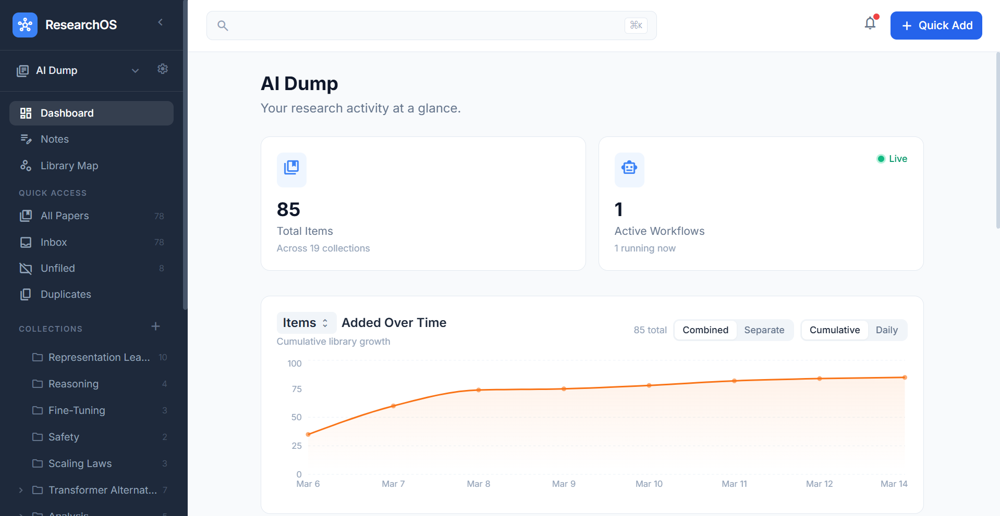

## Features

### Reference Library

- **Library management** — import papers and websites via DOI, arXiv ID, URL, OpenReview, or Zenodo; organize into nested collections with drag-and-drop

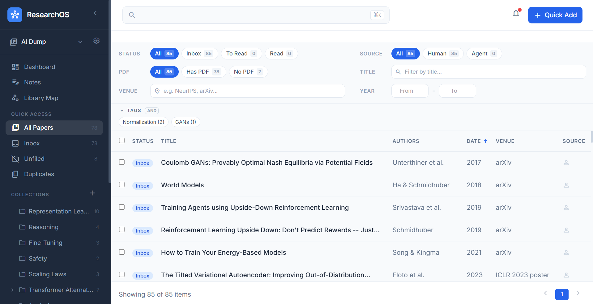

- **Multiple libraries** — create and switch between independent libraries
- **Websites as first-class items** — blog posts, articles, and any URL live alongside papers with their own metadata
- **GitHub repos as first-class items** — track repositories alongside papers and websites; full detail page with metadata, notes, and AI copilot

<p align="center">
  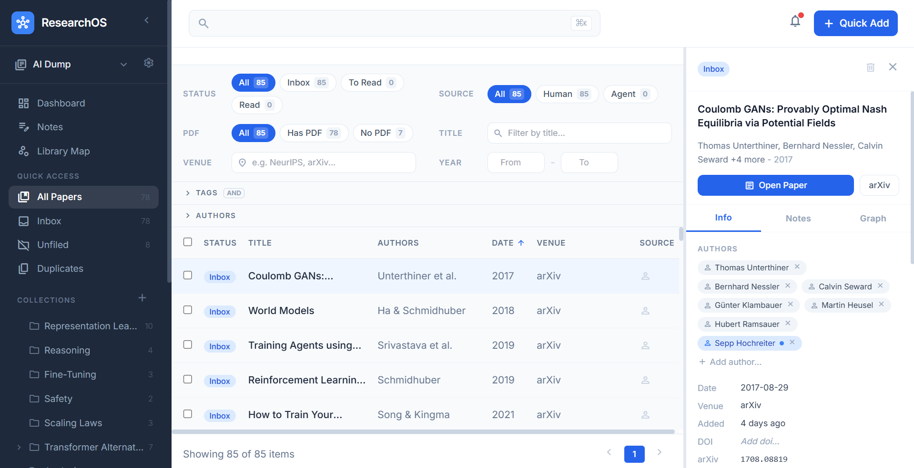
  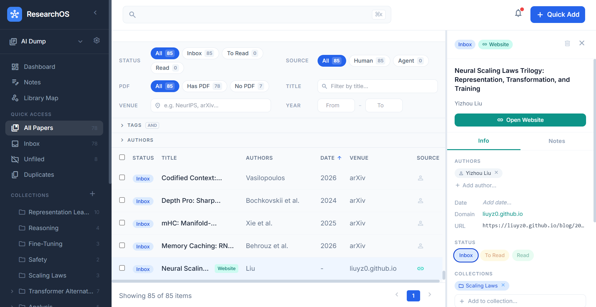
  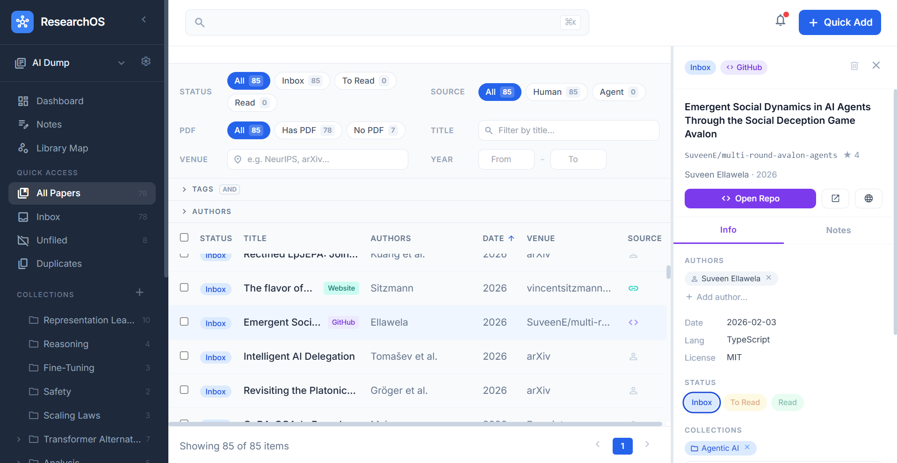
</p>

- **BibTeX import/export** — bulk-import `.bib` files with a two-phase preview/confirm flow; export papers and websites as `.bib` with a tree-view editor for reviewing and editing entries before download
- **Duplicate detection** — centralized three-tier dedup (DOI, arXiv ID, normalized title) across all import paths: identifier import, PDF upload, and BibTeX import; surfaces warnings with "Import anyway" option
- **PDF upload with metadata extraction** — drag-and-drop PDFs; LLM-powered extraction of title, authors, date, venue, abstract, and DOI
- **PDF storage** — stored in Supabase Storage, rendered inline; auto-downloaded from source on import
- **Authors** — first-class author entities with fuzzy name matching across papers
- **Tags and collections** — editable tags on all item types; collections picker for papers, websites, and GitHub repos; export BibTeX from sidebar collection context menu

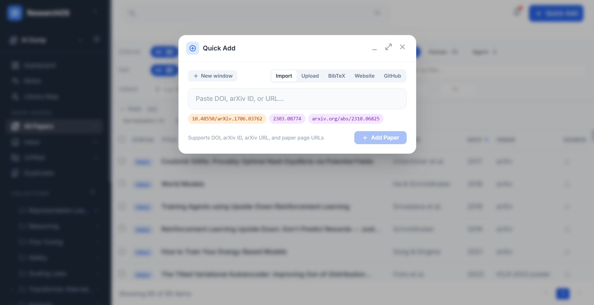

<p align="center">
  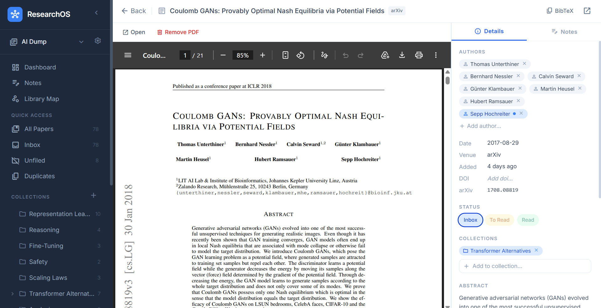
  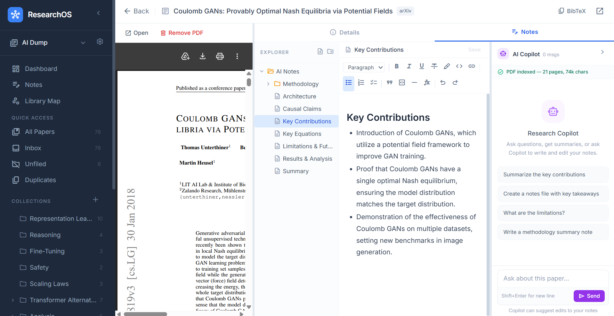
</p>

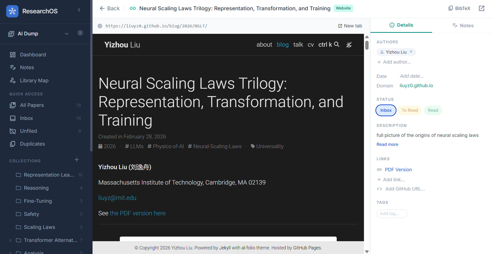

### Search & Discovery

- **Semantic search** — hybrid lexical and OpenAI-embedding search across papers, websites, and GitHub repos (falls back to lexical when no API key is set); `Ctrl+K` / `Cmd+K` global shortcut
- **Related paper discovery** — surfaces related works for any paper via OpenAlex citation links and semantic neighbors
- **Semantic library map** — a 2D scatter plot of all items positioned by semantic similarity (UMAP over cached embeddings); color-coded by collection or item type; brush-select to create collections from clusters

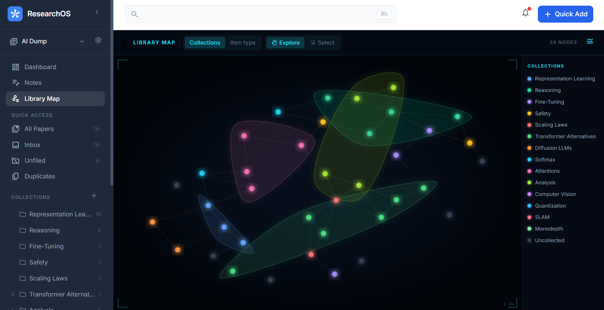

### Notes IDE

- **Rich editor** — multi-tab tiptap WYSIWYG editor available at library level and within each project, covering papers, websites, GitHub repos, and standalone notes
  - LaTeX / KaTeX math rendering
  - `[[wiki-link]]` syntax with autocomplete, click-to-navigate, and a D3 force graph of all link connections
  - Tables with resizable columns, toolbar menu, and right-click context menu
  - Six built-in note templates (Blank, Literature Note, Meeting Note, Experiment Log, Literature Review, Paper Summary)
  - Pinned notes, drag-and-drop reordering, backlinks panel, recent notes, full-text search
  - Export as Markdown, PDF, or LaTeX

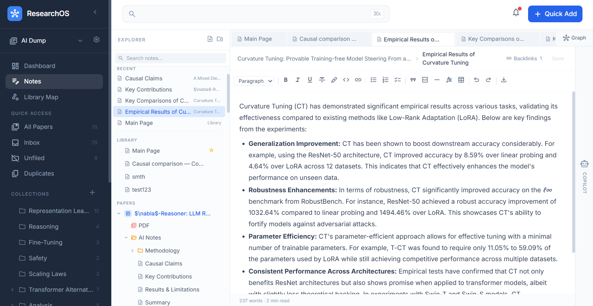

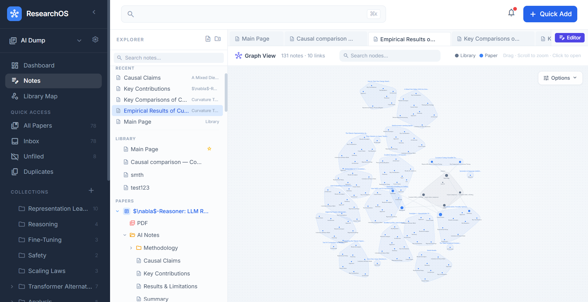

- **LaTeX export** — export notes to compilable LaTeX with citation management
  - `@` mention to insert paper/website citations as inline author-year chips; context menu with open paper, remove, copy key, copy BibTeX entry
  - Export modal with template selection (Article/IEEE/NeurIPS), editable title/author, section reordering for folder exports, cited papers list with auto-generated keys
  - Side-by-side raw `.tex` preview with syntax highlighting, live-updating with ~500ms debounce
  - Download `.zip` with `.tex` + `.bib`; collision-safe citation keys (`smith2024a`/`smith2024b`)

### AI Features

- **AI Auto-Note-Taker** — generates a multi-file note structure for any paper, website, or GitHub repo; auto-runs on import and PDF upload
- **AI copilot** — context-aware research assistant that can suggest diffs to your notes; `[[wiki-link]]` references in chat output are rendered as clickable chips that open the linked note in the IDE
- **Notes-page AI copilot** — library-scoped AI copilot that runs in an agentic loop (up to 6 LLM turns per request); type `@` to select papers, websites, repos, or collections as context; produces `suggest_note_edit` and `suggest_note_create` proposals targeting any item

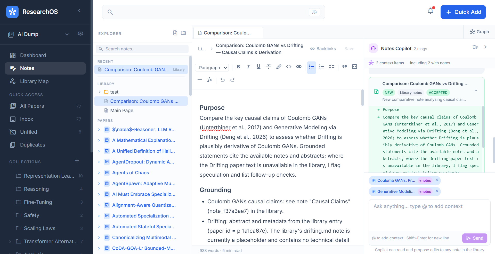

- **AI experiment gap analysis** — analyzes experiment tree configs and linked paper abstracts to suggest missing baselines, ablation gaps, config sweeps, and replications
  - Planning board with suggestion cards on the left, mini experiment tree on the right; drag a card onto a tree node to create a planned experiment
  - Compact suggestion cards with type badge, rationale, config preview, and clickable paper reference chips with inline popover previews
  - Edit suggestion name, rationale, and config in a detail overlay before promoting; dismiss with undo toast
- **Agent workflows** — multi-step research workflows (literature review, model research, experiment design) powered by OpenAI via pydantic-ai
- **Human-in-the-loop proposals** — agents propose changes that you approve or reject with a diff view
- **LLM configuration** — per-role model selection (chat, notes, metadata, agent, embeddings) configurable at runtime from the settings page

### Research Projects

- **Projects** — create research projects within a library; each project has its own overview, literature, experiments, tasks, notes, and review sections
- **Research questions** — hierarchical research question tree with drag-and-drop nesting, status tracking (open/investigating/answered/discarded), and wiki-link references in notes
- **Project-linked papers** — link library papers to projects; linked papers appear in the project's Literature tab and provide context for AI features

### Experiments

- **Experiment tree** — nested experiment hierarchy with configurable status, config (JSONB), and metrics (JSONB); tree view with expand/collapse and drag-and-drop reorder; detail panel with inline editing
- **Experiment differentiators** — compare experiments side-by-side; link papers to experiments for literature grounding; bulk status changes and duplication
- **CSV data loading** — import experiment results from CSV files with column mapping, preview, and merge into existing experiment configs/metrics
- **Experiment table view** — spreadsheet-style view with sortable/filterable columns, bulk selection, multi-select actions (compare, set status, duplicate, delete), and column visibility controls

### Task Management

- **Task database** — project-scoped tasks with title, description, status, priority, due date (with optional time), tags, and custom fields (text, number, date, select, multi-select)
  - **Kanban board** — one column per custom status; drag-and-drop cards between columns; inline task creation; column management (rename, color picker, delete with task migration)
  - **List view** — sortable, filterable table with all fields as columns; filter chips for status, priority, overdue, and custom fields; column visibility picker; custom field management via "+" button
  - **Calendar view** — month grid showing tasks on due dates as colored chips; "+N more" overflow; unscheduled sidebar with drag-to-date assignment; drag-to-reschedule between dates
  - **Task detail** — peek overlay (right half) or modal mode; completed tasks show check icon with strikethrough; status colors consistent across all views

### Dashboard & Navigation

- **Activity feed** — full audit trail of agent and human actions
- **Dashboard triage cards** — Inbox / To Read / Read stat cards navigate directly to the filtered library view on click
- **Keyboard shortcuts** — press `?` for a help overlay listing all active shortcuts (`j`/`k`, `Enter`, `Escape`, status keys, etc.)

## Tech Stack

- **Backend:** Python 3.11+, FastAPI, pydantic-ai, uv
- **Database:** Supabase (PostgreSQL + Storage)
- **AI:** OpenAI
- **Frontend:** React 18, Vite, React Router v6, Tailwind CSS 3
- **Editor:** tiptap v3 with KaTeX, `@tiptap/extension-table`
- **Graph:** D3.js (note graph view, library map)

## Quick Start

```bash
# 1. Set up environment
cp backend/.env.example backend/.env  # Add OPENAI_API_KEY, SUPABASE_URL, SUPABASE_KEY

# 2. Database — run backend/migrations/schema.sql in the Supabase SQL editor

# 3. Backend (port 8000)
cd backend && uv sync && uv run uvicorn app:app --reload --port 8000

# 4. Frontend (port 5173)
cd frontend && npm install && npm run dev
```

Open [http://localhost:5173](http://localhost:5173). See [docs/getting-started.md](docs/getting-started.md) for full setup details.

## Documentation

Detailed documentation lives in [`docs/`](docs/README.md):

| Section | What's covered |
|---------|---------------|
| [User Guide](docs/user-guide.md) | Walkthrough from first papers to AI features |
| [Costs & Privacy](docs/costs-and-privacy.md) | What goes to OpenAI, cost estimates, data ownership |
| [FAQ](docs/faq.md) | Common questions and troubleshooting |
| [Getting Started](docs/getting-started.md) | Prerequisites, env setup, database, running |
| [Architecture](docs/architecture.md) | System design, data model, service layer patterns |
| [Database](docs/database/schema.md) | Schema reference, migrations, conventions |
| [API Reference](docs/api/overview.md) | All endpoints by domain with request/response examples |
| [Frontend](docs/frontend/routing.md) | Routes, state management, key components |
| [AI System](docs/ai/agents.md) | Agent architecture, copilots, gap analysis |
| [Developer Guides](docs/guides/adding-a-new-entity.md) | Adding entities, agents, understanding import pipeline |
| [Testing](docs/testing.md) | Test strategy, running tests, CI |

## Contributing

Contributions are welcome! Please read [CONTRIBUTING.md](CONTRIBUTING.md) to get started. By participating you agree to abide by the [Code of Conduct](CODE_OF_CONDUCT.md).

## License

[MIT](LICENSE)
